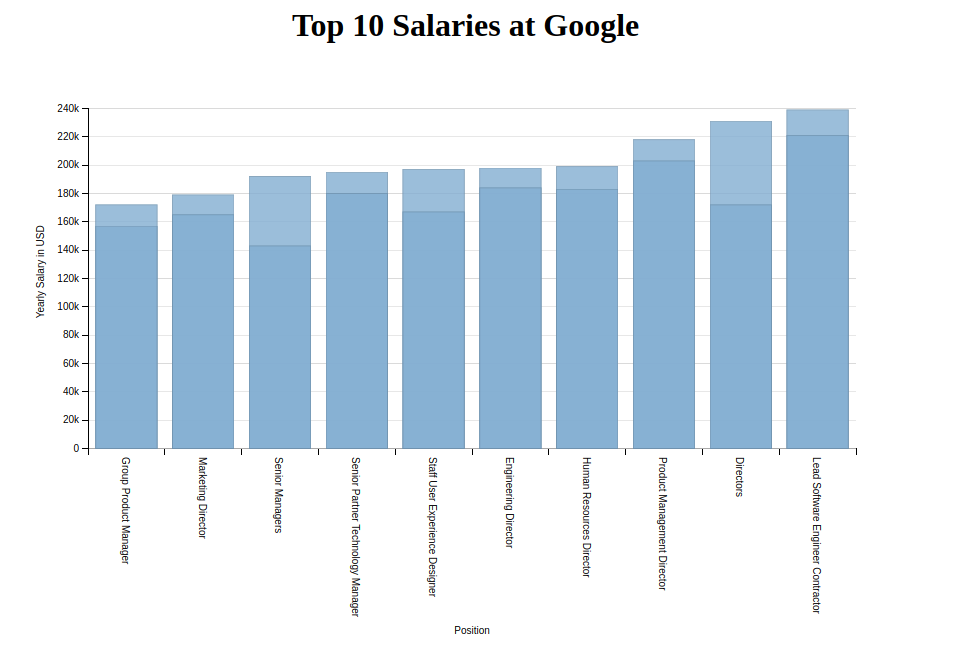

# d3-pset-2

## Assignment
Take a pre-existing data visualization with issues and attempt to improve upon it.

## Source Visualization

I chose this infographic presented on [Business Insider](http://www.businessinsider.com/here-are-the-10-highest-paying-jobs-at-google-2011-10) because the data is not presented in a way that allows for easy comparison.

## Process
I used the d3.js and dimple.js libraries to construct my visualization

## Result
;

## Problems
I was unable to have the animation showing a line from the to of each bar to the corresponding point on the y axis display correctly on the second series of data.

